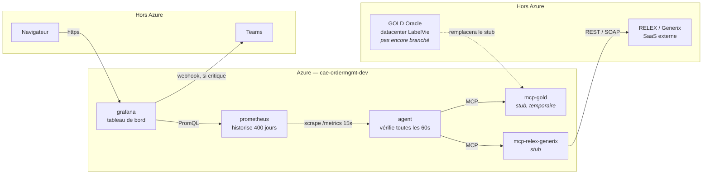

# Supervision Order Management — Guide utilisateur

Ce que tu trouveras ici : ce qui tourne sur Azure, comment une donnée circule de GOLD/RELEX jusqu'au tableau de bord, et les étapes pour passer en production. Version détaillée (schéma technique, journal de déploiement) : [`azure-deployment.md`](./azure-deployment.md).

## Vue d'ensemble

Un agent interroge en continu les systèmes GOLD (ERP Oracle) et RELEX/Generix (approvisionnement), calcule des indicateurs de santé, et les affiche dans un tableau de bord. Aujourd'hui, GOLD et RELEX/Generix tournent en **mode démonstration** (données fictives mais réalistes) — le code et l'infrastructure sont prêts à recevoir les vrais systèmes sans être réécrits.

| | |
|---|---|
| **6** | applications Azure, dans un seul environnement |
| **38** | indicateurs unitaires suivis, + 6 chapeaux + 1 indicateur de tête |
| **60 s** | entre deux vérifications de l'agent |
| **400 j** | d'historique conservé pour revoir une période passée |

## Architecture

Chaque flèche part de l'application qui interroge vers celle qui répond (sauf l'alerte Teams, poussée par Grafana). Les cases bleues tournent dans Azure ; les cases grises sont hors d'Azure.

> Non représenté pour la lisibilité : les 5 apps Azure lisent leurs mots de passe et clés dans le **Key Vault** et récupèrent leur image dans le **registre ACR** au démarrage — jamais de secret écrit en clair dans le code.

## Ce qui est déployé

| Application | Rôle | Ressource Azure | Mode |
|---|---|---|---|
| **agent** | Interroge GOLD et RELEX/Generix, calcule les indicateurs | `ca-ordermgmt-dev-agent` | — |
| **mcp-gold** | Connecteur vers l'ERP Oracle GOLD | `ca-ordermgmt-dev-gold` | stub, temporaire |
| **mcp-relex-generix** | Connecteur vers RELEX (REST) et Generix (SOAP/EDI) | `ca-ordermgmt-dev-relex-generix` | stub |
| **prometheus** | Historise les indicateurs (400 jours) | `ca-ordermgmt-dev-prometheus` | — |
| **grafana** | Tableau de bord — seule app exposée au public | `ca-ordermgmt-dev-grafana` | public |
| **Key Vault** | Coffre-fort des mots de passe, clés API, secrets | `kv-ordermgmtda4e111` | — |
| **Registre (ACR)** | Stocke les images des 5 applications ci-dessus | `acrordermgmtdeva4e111` | — |

## Comment ça marche

Le cycle qui tourne en continu, toutes les 60 secondes :

1. **L'agent interroge GOLD et RELEX/Generix.** Toutes les 60 secondes, l'agent appelle les deux connecteurs (`mcp-gold`, `mcp-relex-generix`) pour récupérer l'état des commandes, des cycles de réapprovisionnement et des flux WMS.
2. **Il calcule les indicateurs.** 38 indicateurs unitaires, regroupés en 6 indicateurs « chapeau » et 1 indicateur de tête — chacun classé OK, attention, critique ou inconnu (si une donnée n'a pas pu être récupérée).
3. **Prometheus vient récupérer ces valeurs.** Prometheus interroge l'agent toutes les 15 secondes et garde 400 jours d'historique, pour pouvoir revoir une période passée plus tard.
4. **Grafana affiche et surveille.** Le tableau de bord public traduit ces chiffres en langage clair (« Conforme », « À vérifier », « Bloquant »). Si un chapeau passe critique, Grafana envoie une alerte dans Teams.

## Passer en production

Dans cet ordre, quand LabelVie est prêt à brancher les vrais systèmes GOLD, RELEX et Generix :

1. **Déployer mcp-gold on-premises.** Dans le datacenter LabelVie, avec le VPN Gateway activé (`deploy_vpn_gateway = true`). C'est la ressource la plus longue à créer — compter 30 à 45 minutes.
2. **Activer les connecteurs « live ».** Décommenter `LiveGoldConnector`, `LiveRelexConnector` et `LiveGenerixConnector` dans le code, puis reconstruire les images.
3. **Renseigner les vrais identifiants dans le Key Vault.** Jamais dans le code : `oracle-dsn`, `oracle-user`, `oracle-password`, `relex-client-id`, `relex-client-secret`, `relex-api-key`, `generix-api-key`.
4. **Basculer les modes de « stub » à « live ».** `GOLD_MODE`, `RELEX_MODE` et `GENERIX_MODE` passent à `live` sur les applications concernées.
5. **Retirer le mcp-gold temporaire.** Supprimer `ca-ordermgmt-dev-gold` (le stub de démo) et rebrancher l'agent sur le vrai serveur on-premises, désormais joignable par le VPN.
6. **Remplacer les mots de passe placeholder.** `grafana-admin-password` et `teams-webhook-url` valent encore `changeme` — à remplacer par les vraies valeurs dans le Key Vault.
7. **Remettre Terraform au courant.** Certaines applications ont été créées à la main pendant le dépannage. Avant de redonner la main au pipeline automatique, les importer dans le state Terraform (détail dans [`azure-deployment.md`](./azure-deployment.md)).

## Repères techniques

| | |
|---|---|
| Resource group | `lbv-rg-monitoring-agent-ordermgnt` |
| Région | West Europe |
| Environnement Container Apps | `cae-ordermgmt-dev` |
| Registre d'images (ACR) | `acrordermgmtdeva4e111.azurecr.io` |
| Key Vault | `kv-ordermgmtda4e111` |
| Dashboard Grafana | `ca-ordermgmt-dev-grafana.whitesky-0ae7e99f.westeurope.azurecontainerapps.io` |
| Dépôt GitHub | `dadaw-maker/monitoring-agent` |
| Journal détaillé | [`azure-deployment.md`](./azure-deployment.md) |

---

*Reflète le déploiement réel — pas un plan. Le journal complet (commandes, bugs rencontrés) vit dans [`azure-deployment.md`](./azure-deployment.md).*
