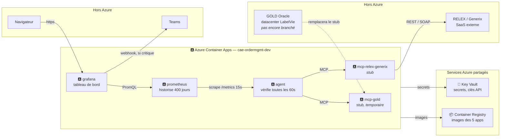
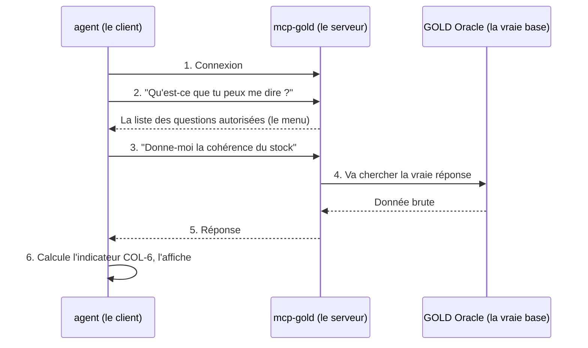
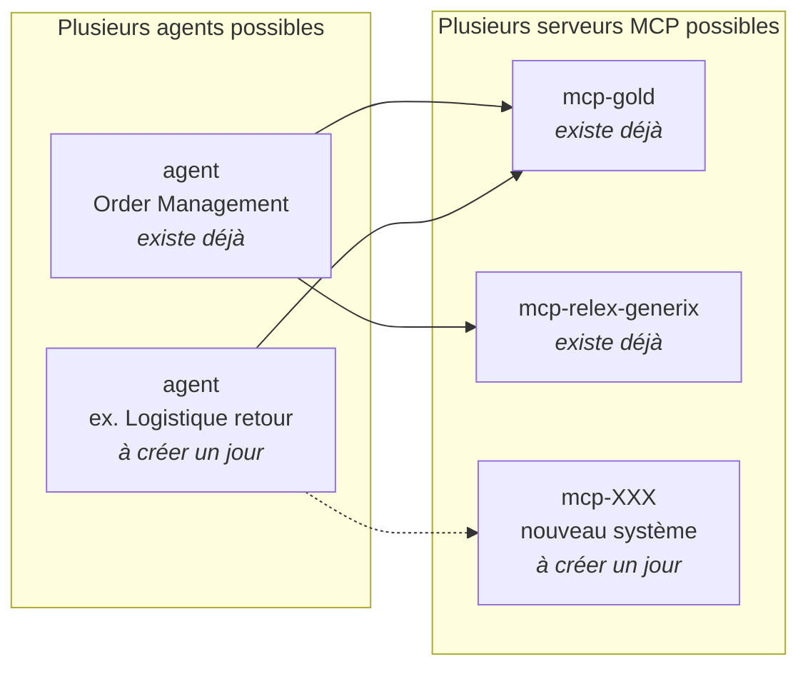

# Supervision Order Management — Guide utilisateur

Ce que tu trouveras ici : ce qui tourne sur Azure, comment une donnée circule de GOLD/RELEX jusqu'au tableau de bord, comment fonctionne le mécanisme qui va chercher ces données (MCP), comment faire grandir le système plus tard, et les étapes pour passer en production. Version détaillée (schéma technique, journal de déploiement) : [`azure-deployment.md`](./azure-deployment.md).

## Vue d'ensemble

Un agent interroge en continu les systèmes GOLD (ERP Oracle) et RELEX/Generix (approvisionnement), calcule des indicateurs de santé, et les affiche dans un tableau de bord. Aujourd'hui, GOLD et RELEX/Generix tournent en **mode démonstration** (données fictives mais réalistes) — le code et l'infrastructure sont prêts à recevoir les vrais systèmes sans être réécrits.

| | |
|---|---|
| **6** | applications Azure, dans un seul environnement |
| **38** | indicateurs unitaires suivis, + 6 chapeaux + 1 indicateur de tête |
| **60 s** | entre deux vérifications de l'agent |
| **400 j** | d'historique conservé pour revoir une période passée |

## Architecture

Chaque flèche part de l'application qui interroge vers celle qui répond (sauf l'alerte Teams, poussée par Grafana, et les flèches « secrets »/« images », poussées par le besoin des 5 apps au démarrage). Les cases bleues tournent comme **Azure Container Apps**, dans le même environnement ; en dessous, les deux services Azure partagés dont ces apps dépendent au démarrage. Les cases grises sont hors d'Azure.

> **Au démarrage**, chaque appli de l'environnement lit ses identifiants dans Key Vault et récupère son image dans le registre — jamais de secret écrit en clair dans le code.

## Comment l'agent va chercher ses données (MCP), étape par étape

Sur le schéma ci-dessus, les flèches marquées « MCP » entre `agent` et les deux connecteurs (`mcp-gold`, `mcp-relex-generix`) méritent une explication à part — c'est le mécanisme central de tout le système. Pas besoin de savoir coder pour comprendre cette section.

### L'idée en une phrase

MCP, c'est une façon standardisée de poser une question à un système et d'obtenir une réponse — un peu comme un client qui commande au menu d'un restaurant, sans avoir besoin de savoir cuisiner ni de rentrer dans la cuisine.

- **L'agent** joue le rôle du client : il pose des questions précises ("quel est l'état du stock ?"), toujours parmi une liste fixée à l'avance.
- **`mcp-gold`** (ou `mcp-relex-generix`) joue le rôle du serveur de restaurant : il connaît le menu, va chercher la réponse en cuisine (dans la vraie base de données GOLD, ou le vrai système RELEX), et la rapporte.
- **GOLD / RELEX** sont la cuisine : c'est là que la vraie donnée existe. L'agent n'y a jamais un accès direct — il passe toujours par le serveur.

Ce détour a un avantage de sécurité important : **l'agent ne connaît jamais les mots de passe de GOLD, ni sa structure interne.** Il ne peut demander que ce qui figure au menu — impossible d'improviser une question non prévue. C'est ce qui protège GOLD d'une erreur ou d'un usage détourné côté agent.

### Le trajet d'une question, en 6 étapes

Prenons un exemple concret : l'agent veut savoir si le stock enregistré dans GOLD correspond au stock physique réel (l'indicateur **COL-6**).

1. **Connexion.** L'agent ouvre une petite conversation avec `mcp-gold` — courte, elle se referme juste après.
2. **"Qu'est-ce que tu peux me dire ?"** L'agent demande la liste des questions autorisées (le "menu"). `mcp-gold` répond avec 13 questions possibles : état du stock, statut du lot de nuit, retards de collecte, etc.
3. **La question posée.** L'agent choisit une question dans cette liste — ici, "cohérence du stock" — et l'envoie.
4. **La vraie recherche.** `mcp-gold` va chercher la vraie réponse dans GOLD. C'est la seule étape qui touche vraiment la base Oracle — et c'est du code tout à fait classique de ce côté-là, rien de spécifique à MCP.
5. **La réponse.** `mcp-gold` renvoie le résultat à l'agent, dans un format simple (une petite fiche de valeurs).
6. **Le calcul.** L'agent transforme cette réponse en indicateur (OK / à surveiller / critique), qui finit par s'afficher dans Grafana.

Ce cycle se répète **toutes les 60 secondes**, pour chacune des ~20 questions que l'agent pose (13 vers GOLD, le reste vers RELEX/Generix) — pas l'une après l'autre, mais toutes en même temps, pour que le cycle reste rapide.

### Pourquoi c'est construit comme ça

- **Sécurité par liste fermée.** L'agent ne peut jamais poser une question hors du "menu" — même si quelque chose tournait mal côté agent, il ne pourrait pas improviser une requête dangereuse contre GOLD.
- **Le vrai travail est toujours du bon côté.** Toute la connaissance de GOLD (mots de passe, structure des tables) vit uniquement dans `mcp-gold`, jamais dans l'agent. Si GOLD change un jour, seul `mcp-gold` doit être mis à jour.
- **Aujourd'hui, la "cuisine" est fictive.** En ce moment, `mcp-gold` ne va pas vraiment chercher la réponse dans Oracle — il invente une réponse plausible (mode démonstration, voir "Ce qui est déployé"). Le jour où on branche la vraie base, on peut le faire **question par question** : remplacer une seule réponse fictive par une vraie recherche, sans toucher au reste ni casser quoi que ce soit — voir "Passer en production" plus bas.

## Ce qui est déployé

| Application | Rôle | Ressource Azure | Mode |
|---|---|---|---|
| **agent** | Interroge GOLD et RELEX/Generix, calcule les indicateurs | `ca-ordermgmt-dev-agent` | — |
| **mcp-gold** | Connecteur vers l'ERP Oracle GOLD | `ca-ordermgmt-dev-gold` | stub, temporaire |
| **mcp-relex-generix** | Connecteur vers RELEX (REST) et Generix (SOAP/EDI) | `ca-ordermgmt-dev-relex-generix` | stub |
| **prometheus** | Historise les indicateurs (400 jours) | `ca-ordermgmt-dev-prometheus` | — |
| **grafana** | Tableau de bord — seule app exposée au public | `ca-ordermgmt-dev-grafana` | public |
| **Key Vault** | Coffre-fort des mots de passe, clés API, secrets | `kv-ordermgmtda4e111` | — |
| **Registre (ACR)** | Stocke les images des 5 applications ci-dessus | `acrordermgmtdeva4e111` | — |

## Comment ça marche

Le cycle qui tourne en continu, toutes les 60 secondes :

1. **L'agent interroge GOLD et RELEX/Generix.** Toutes les 60 secondes, l'agent appelle les deux connecteurs (`mcp-gold`, `mcp-relex-generix`) pour récupérer l'état des commandes, des cycles de réapprovisionnement et des flux WMS.
2. **Il calcule les indicateurs.** 38 indicateurs unitaires, regroupés en 6 indicateurs « chapeau » et 1 indicateur de tête — chacun classé OK, attention, critique ou inconnu (si une donnée n'a pas pu être récupérée).
3. **Prometheus vient récupérer ces valeurs.** Prometheus interroge l'agent toutes les 15 secondes et garde 400 jours d'historique, pour pouvoir revoir une période passée plus tard.
4. **Grafana affiche et surveille.** Le tableau de bord public traduit ces chiffres en langage clair (« Conforme », « À vérifier », « Bloquant »). Si un chapeau passe critique, Grafana envoie une alerte dans Teams.

## Passer en production

Dans cet ordre, quand LabelVie est prêt à brancher les vrais systèmes GOLD, RELEX et Generix :

1. **Déployer mcp-gold on-premises.** Dans le datacenter LabelVie, avec le VPN Gateway activé (`deploy_vpn_gateway = true`). C'est la ressource la plus longue à créer — compter 30 à 45 minutes.
2. **Activer les connecteurs « live ».** Décommenter `LiveGoldConnector`, `LiveRelexConnector` et `LiveGenerixConnector` dans le code, puis reconstruire les images.
3. **Renseigner les vrais identifiants dans le Key Vault.** Jamais dans le code : `oracle-dsn`, `oracle-user`, `oracle-password`, `relex-client-id`, `relex-client-secret`, `relex-api-key`, `generix-api-key`.
4. **Basculer les modes de « stub » à « live ».** `GOLD_MODE`, `RELEX_MODE` et `GENERIX_MODE` passent à `live` sur les applications concernées.
5. **Retirer le mcp-gold temporaire.** Supprimer `ca-ordermgmt-dev-gold` (le stub de démo) et rebrancher l'agent sur le vrai serveur on-premises, désormais joignable par le VPN.
6. **Remplacer les mots de passe placeholder.** `grafana-admin-password` et `teams-webhook-url` valent encore `changeme` — à remplacer par les vraies valeurs dans le Key Vault.
7. **Remettre Terraform au courant.** Certaines applications ont été créées à la main pendant le dépannage. Avant de redonner la main au pipeline automatique, les importer dans le state Terraform (détail dans [`azure-deployment.md`](./azure-deployment.md)).

## Faire grandir le système (scalabilité)

Le découpage en "serveurs" (`mcp-gold`, `mcp-relex-generix`) et "client" (`agent`) — expliqué juste au-dessus — a un avantage qu'on n'a pas encore exploité : **on peut ajouter d'autres clients et d'autres serveurs sans toucher à l'existant.** Deux façons de faire grandir le système :

### 1. Ajouter un autre client (un autre "agent")

Si LabelVie veut un jour superviser un **autre processus métier** (par exemple la logistique retour, ou un autre flux), on peut créer un deuxième agent qui pose ses propres questions à `mcp-gold` et `mcp-relex-generix` — **les mêmes serveurs que ceux qui existent déjà, sans rien y changer.**

C'est possible parce que `mcp-gold` ne sait pas — et n'a pas besoin de savoir — qui lui pose une question. Il répond à n'importe quel client autorisé à s'y connecter, du moment que la question fait partie du "menu". Ajouter un deuxième agent, c'est donc :
- créer un nouveau service (sur le modèle de `agent/`),
- lui donner l'adresse des serveurs MCP existants,
- le déployer comme une nouvelle application Azure Container Apps.

Aucune modification de `mcp-gold` ou `mcp-relex-generix` n'est nécessaire pour ça.

### 2. Ajouter un autre serveur MCP (un autre système à interroger)

Si LabelVie veut brancher un **nouveau système** (un autre ERP, un outil métier, une base spécifique), on crée un nouveau serveur MCP sur le modèle exact de `mcp-gold` :

1. **Créer un nouveau service**, en copiant la structure de `mcp_gold/` comme modèle.
2. **Définir le "menu"** — la liste des questions que ce nouveau serveur pourra répondre (l'équivalent des 13 questions de `mcp-gold`).
3. **Commencer en mode démonstration** (comme `mcp-gold` aujourd'hui) — des réponses fictives mais réalistes, pour pouvoir tester tout le reste (l'agent, les indicateurs, le tableau de bord) sans dépendre du vrai système tout de suite.
4. **Déployer** ce nouveau serveur comme une nouvelle application Azure Container Apps, à côté des 6 existantes.
5. **Donner son adresse à l'agent** (ou à un nouvel agent) pour qu'il commence à lui poser des questions.

Là non plus, aucune modification de `agent`, `mcp-gold` ou `mcp-relex-generix` n'est nécessaire — le nouveau serveur vient s'ajouter à côté, indépendamment.

### En résumé

| | Ce qui doit changer |
|---|---|
| Ajouter un client (agent) | Rien côté serveurs existants — seulement créer et déployer le nouvel agent |
| Ajouter un serveur MCP | Rien côté agent(s) existant(s) — seulement créer et déployer le nouveau serveur, puis indiquer son adresse à qui doit l'utiliser |

C'est le même principe que celui qui permet de brancher GOLD "petit à petit" (question par question, voir la section précédente) : chaque brique — client ou serveur — peut évoluer ou s'ajouter indépendamment des autres, tant que tout le monde continue à se parler avec le même protocole standard (MCP).

## Repères techniques

| | |
|---|---|
| Resource group | `lbv-rg-monitoring-agent-ordermgnt` |
| Région | West Europe |
| Environnement Container Apps | `cae-ordermgmt-dev` |
| Registre d'images (ACR) | `acrordermgmtdeva4e111.azurecr.io` |
| Key Vault | `kv-ordermgmtda4e111` |
| Dashboard Grafana | `ca-ordermgmt-dev-grafana.whitesky-0ae7e99f.westeurope.azurecontainerapps.io` |
| Dépôt GitHub | `dadaw-maker/monitoring-agent` |
| Journal détaillé | [`azure-deployment.md`](./azure-deployment.md) |

---

*Reflète le déploiement réel — pas un plan. Le journal complet (commandes, bugs rencontrés) vit dans [`azure-deployment.md`](./azure-deployment.md).*
