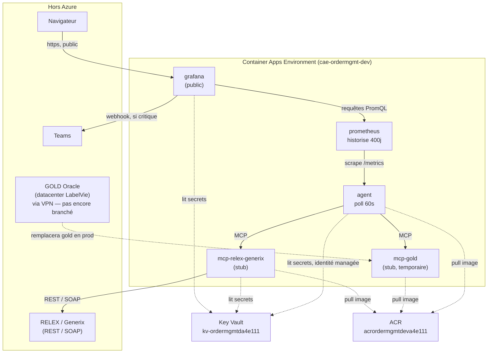

# Journal de déploiement Azure — LabelVie

Suivi concret du bootstrap CI/CD pour **ce** déploiement (valeurs réelles, pas génériques — le guide générique reste [`CI-CD.md`](./CI-CD.md)). Tout se fait depuis le **Cloud Shell Azure** (portal.azure.com → icône Cloud Shell).

## En résumé, pour tout le monde

Ce document raconte comment on branche un projet (le code sur GitHub) sur Azure, pour qu'à chaque mise à jour du code, l'application se redéploie **toute seule**, sans qu'on ait à s'en occuper à la main. La première fois, il faut poser quelques fondations manuellement — ensuite, c'est automatique.

Voici les grandes étapes, dans l'ordre, en langage simple :

1. **Un endroit pour se souvenir de ce qui a été créé.** L'outil qu'on utilise pour construire l'infrastructure sur Azure (Terraform) doit noter quelque part ce qu'il a déjà mis en place, pour ne pas tout recréer à chaque fois. On lui a donné un petit espace de stockage dédié à ça (un "compte de stockage").

2. **Une carte d'identité pour que GitHub puisse parler à Azure, sans mot de passe.** Pour que GitHub puisse créer des choses dans Azure automatiquement, il faut qu'Azure sache "faire confiance" à GitHub. On a créé une identité technique (`github-ordermgmt-deploy`) et on lui a donné le droit d'agir dans Azure, mais seulement pour ce projet précis et seulement quand la demande vient bien de notre dépôt GitHub — jamais de mot de passe stocké nulle part.

3. **Prévenir GitHub où stocker ces informations.** Les identifiants créés à l'étape 2 (et quelques réglages techniques) ont été enregistrés dans les paramètres du dépôt GitHub, pour que le robot de déploiement (GitHub Actions) puisse les utiliser automatiquement plus tard.

4. **Un coffre pour ranger les images de l'application.** Le code de l'application doit être "empaqueté" (comme une boîte prête à l'emploi, appelée une "image") avant de pouvoir tourner dans Azure. Ces boîtes sont rangées dans un registre dédié (l'ACR), qu'on a créé et qu'on a dû ajuster une fois pour que les bons outils puissent y déposer des images.

5. **Construire et déposer les premières boîtes.** On a construit les 3 "boîtes" de l'application (l'agent de supervision, et les deux connecteurs vers les systèmes GOLD et RELEX/Generix) et on les a déposées dans le registre créé à l'étape 4.

6. **Faire tourner le tout dans Azure.** Une dernière commande crée le reste : le réseau, le coffre à secrets (mots de passe, clés), et les 4 applications qui tournent réellement (l'agent, le connecteur RELEX/Generix, Prometheus qui stocke l'historique des indicateurs, et Grafana qui affiche le tableau de bord).

Une fois ces 6 étapes faites une bonne fois, on n'a plus besoin d'y retoucher : à chaque fois que du code est modifié sur GitHub, tout se reconstruit et se redéploie automatiquement.

*Le reste du document est la version technique, avec les commandes exactes — utile pour reprendre où on s'est arrêté, ou pour tout refaire depuis le début si besoin. N'hésite pas à modifier ce texte au fil de l'eau si quelque chose change.*

## Valeurs de ce déploiement

| Élément | Valeur |
|---|---|
| Resource group (existant, adopté par Terraform) | `lbv-rg-monitoring-agent-ordermgnt` |
| Région | West Europe |
| Compte de stockage — backend Terraform | `stordermgmttfstate` |
| Container — backend Terraform | `tfstate` |
| Identité managée CI/CD | `github-ordermgmt-deploy` |
| Dépôt GitHub | `dadaw-maker/monitoring-agent` |
| GitHub Organization ID (numérique) | `270965870` |
| GitHub Repository ID (numérique) | `1191809919` |
| Environnement GitHub | `azure-production` |
| ACR (registre d'images), créé au Bloc 4 | `acrordermgmtdeva4e111` (`.azurecr.io`) |
| Key Vault | `kv-ordermgmtda4e111` |
| Environnement Container Apps | `cae-ordermgmt-dev` |
| Dashboard Grafana (public) | `https://ca-ordermgmt-dev-grafana.whitesky-0ae7e99f.westeurope.azurecontainerapps.io` (admin / secret Key Vault `grafana-admin-password`) |

> ⚠️ **Si le Cloud Shell se déconnecte/redémarre**, il repart dans `~` (`/home/<toi>`), sans mémoire des `cd` précédents ni des variables shell (`$ACR`). Le dépôt cloné devrait rester sur le disque persistant de Cloud Shell, mais dans le doute vérifier avec `ls ~` avant de relancer une commande.

## État final : tout tourne, déployé à la main

Le `terraform apply` du Bloc 6 s'est fait interrompre par une perte de session Cloud Shell (voir le log détaillé plus bas), avec un state Terraform coincé (lock) et deux Container Apps détruites au milieu de leur recréation. Plutôt que de continuer à lutter contre Terraform, on a fini le déploiement **à la main**, directement en CLI Azure, pour les pièces qui manquaient. Résultat : **les 6 briques tournent**, mais Terraform ne les connaît plus toutes — voir "Passer en production" plus bas pour la remise en ordre.

### Les 6 Container Apps déployées

| Container App | Rôle | Mode |
|---|---|---|
| `ca-ordermgmt-dev-agent` | Agent de supervision — interroge GOLD et RELEX/Generix toutes les 60s, calcule les 34 indicateurs + 6 chapeaux + tête, les publie pour Prometheus | — |
| `ca-ordermgmt-dev-gold` | Connecteur GOLD (Oracle ERP) | **stub, temporaire** — en production tourne on-premises (§ Passer en production) |
| `ca-ordermgmt-dev-relex-generix` | Connecteur RELEX (REST) + Generix (SOAP/EDI) | **stub** |
| `ca-ordermgmt-dev-prometheus` | Stocke l'historique des indicateurs (400 jours de rétention) | — |
| `ca-ordermgmt-dev-grafana` | Dashboard — seule app exposée publiquement | — |

### Deux bugs Azure CLI rencontrés en cours de route (à retenir)

- **`az containerapp create --yaml`** renvoie systématiquement `Bad Request ... could not be converted to System.Boolean` sur ce Cloud Shell, quel que soit le contenu du fichier (testé avec YAML valide, puis JSON valide, sans autre flag concurrent). Contournement fiable : **`az deployment group create --template-file`** (un vrai template ARM) — chemin de code différent, fonctionne à chaque fois.
- **`az containerapp create --env-vars`** et **`az containerapp update --set-env-vars`** perdent silencieusement la valeur des variables "en clair" (`NAME=value`) — seules celles en `secretref:...` survivent. Se voit dans `az containerapp show ... --query "properties.template.containers[0].env"` : `{"name": "X"}` sans `"value"`. Même contournement : passer par un template ARM (`az deployment group create`) plutôt que les flags `create`/`update`.

Les fichiers `*.json`/`*-arm.json` créés pendant cette phase manuelle (dans `infra/`) ne sont **pas** commités dans le dépôt (scratch local Cloud Shell) — c'est normal, ils ne sont pas censés survivre : la vraie définition de l'infra reste le code Terraform dans `infra/*.tf`.

## Schéma d'architecture



## Passer en production

Dans l'ordre, quand LabelVie est prêt à brancher les vrais systèmes :

1. **Déployer `mcp-gold` on-premises** dans le datacenter LabelVie (c'est prévu pour, voir `specs.md` §9) et activer le VPN Gateway (`deploy_vpn_gateway = true` dans `terraform.tfvars`, puis `terraform apply` — c'est la ressource la plus longue à créer, compter 30-45 min).
2. **Décommenter les connecteurs "live"** dans le code (marqués et expliqués en commentaire dans chaque fichier) :
   - `services/mcp_gold/app/connectors.py` → `LiveGoldConnector`
   - `services/mcp_relex_generix/app/connectors.py` → `LiveRelexConnector` / `LiveGenerixConnector`
   
   Puis reconstruire et repousser les images (`az acr build` ou le pipeline GitHub Actions).
3. **Renseigner les vrais identifiants dans le Key Vault** `kv-ordermgmtda4e111` (jamais dans le code ni dans Terraform) : `oracle-dsn`, `oracle-user`, `oracle-password`, `relex-client-id`, `relex-client-secret`, `relex-api-key`, `generix-api-key`. Remplace directement la valeur du secret existant (le Key Vault garde l'historique des versions).
4. **Basculer les modes de "stub" à "live"** : `GOLD_MODE=live`, `RELEX_MODE=live`, `GENERIX_MODE=live` sur les Container Apps correspondantes (`az containerapp update --set-env-vars ...` — ou, plus fiable vu le bug documenté plus haut, un petit template ARM comme `fix-envvars.json`).
5. **Supprimer `ca-ordermgmt-dev-gold`** (le stub temporaire dans Azure) et rebrancher `MCP_GOLD_URL` sur l'agent vers l'hôte on-premises réel (`https://<hôte-onprem>:8001/mcp`), maintenant joignable via le VPN de l'étape 1.
6. **Remplacer les mots de passe placeholder** (`grafana-admin-password`, `teams-webhook-url` valent encore `changeme` dans le Key Vault) par les vraies valeurs.
7. **Réconcilier Terraform** : plusieurs ressources ont été créées à la main pendant le dépannage (voir plus haut) et n'existent pas dans le state Terraform. Avant de redonner la main au pipeline GitHub Actions, les importer une par une :
   ```bash
   terraform import azurerm_container_app.mcp_relex_generix /subscriptions/.../resourceGroups/lbv-rg-monitoring-agent-ordermgnt/providers/Microsoft.App/containerApps/ca-ordermgmt-dev-relex-generix
   terraform import azurerm_container_app.agent .../containerApps/ca-ordermgmt-dev-agent
   terraform import azurerm_container_app.prometheus .../containerApps/ca-ordermgmt-dev-prometheus
   terraform import azurerm_container_app.grafana .../containerApps/ca-ordermgmt-dev-grafana
   ```
   (`ca-ordermgmt-dev-gold` n'a pas d'équivalent dans le code Terraform — normal, c'est un stub temporaire hors architecture cible, à supprimer plutôt qu'à importer, cf. étape 5.)

## Bloc 0 — à refaire à chaque nouvelle session Cloud Shell

Avant de reprendre n'importe quel autre bloc, ce bloc remet tout en état (sans risque de le rejouer même si rien n'a été perdu — il ne fait qu'écraser des fichiers locaux avec le même contenu et ré-initialiser Terraform sur le même state distant) :

```bash
az account show || az login   # si erreur AAD/login, relancer "az login" à la main

cd ~/monitoring-agent/MonitoringAgent || {
  cd ~
  git clone https://github.com/dadaw-maker/monitoring-agent.git
  cd monitoring-agent
  git checkout claude/agent-azure-container-order-management-qf4arn
  cd MonitoringAgent
}

ACR=acrordermgmtdeva4e111

cd infra

cat > backend.hcl <<'EOF'
resource_group_name  = "lbv-rg-monitoring-agent-ordermgnt"
storage_account_name = "stordermgmttfstate"
container_name        = "tfstate"
key                    = "ordermgmt.tfstate"
EOF

cat > terraform.tfvars <<'EOF'
project              = "ordermgmt"
environment           = "dev"
location              = "westeurope"
resource_group_name   = "lbv-rg-monitoring-agent-ordermgnt"

deploy_vpn_gateway            = false
onprem_address_space          = "10.100.0.0/16"
onprem_vpn_gateway_public_ip  = "203.0.113.10"
mcp_gold_onprem_host          = "mcp-gold.labelvie.internal"
vpn_shared_key                 = "changeme"

gold_mode     = "stub"
relex_mode    = "stub"
generix_mode  = "stub"
EOF

terraform init -backend-config=backend.hcl
```

Après ce bloc : `cd ..` pour revenir à `MonitoringAgent/` avant un `az acr build` (`$ACR` est déjà défini), ou rester dans `infra/` pour un `terraform plan`/`apply`.

## État d'avancement

- [x] **Étape A** — Compte de stockage `stordermgmttfstate` + container `tfstate` créés (via le Portail, Primary service = *Azure Blob Storage or Azure Data Lake Storage Gen 2*, Standard, LRS)
- [x] **Étape B** — Identité managée `github-ordermgmt-deploy` créée, avec :
  - Federated credential `github-azure-production-environment` (Entity type: Environment, valeur `azure-production`)
  - Federated credential `github-pull-requests` (Entity type: Pull request)
  - Rôle **Contributor** sur `lbv-rg-monitoring-agent-ordermgnt`
  - Rôle **User Access Administrator** sur `lbv-rg-monitoring-agent-ordermgnt` (a nécessité que l'admin élargisse la condition de délégation sur son propre rôle, ou fasse l'attribution lui-même — bloqué un moment sur ce point)
- [x] **Étape C** — Variables GitHub créées (`Settings → Secrets and variables → Actions → Variables`) : `AZURE_CLIENT_ID`, `AZURE_CLIENT_OBJECT_ID`, `AZURE_TENANT_ID`, `AZURE_SUBSCRIPTION_ID`, `TF_BACKEND_RESOURCE_GROUP`, `TF_BACKEND_STORAGE_ACCOUNT`, `TF_BACKEND_CONTAINER`, `TF_BACKEND_KEY`
- [x] **Étape D** — Environnement GitHub `azure-production` créé
- [x] **Bloc 1-3** — Dépôt cloné, `terraform.tfvars` créé, resource group importé (*"Import successful!"*)
- [x] **Bloc 4** — Apply partiel fait (resource group + ACR `acrordermgmtdeva4e111` + Key Vault créés)
- [x] Variable GitHub `ACR_LOGIN_SERVER` = `acrordermgmtdeva4e111.azurecr.io`
- [x] **Bloc 5** — Build + push des 3 images via `az acr build` (agent, mcp-gold, mcp-relex-generix — les 3 confirmés dans le registre)
- [x] **Bloc 6** — fait à la main (voir "État final" plus bas) après une session Cloud Shell perdue en plein `terraform apply` — bug NSG corrigé dans le code, mais le reste des 4 apps a été recréé en CLI Azure plutôt que de relancer Terraform
- [x] Vérification : dashboard Grafana accessible, connexion admin OK, pipeline agent → gold/relex (stub) → prometheus → grafana bouclé de bout en bout

### Correctif appliqué en cours de route : accès réseau ACR/Key Vault/stockage

`az acr build` a échoué avec *"client with IP ... is not allowed access"* : l'ACR était configuré avec `public_network_access_enabled = false` (accès uniquement via private endpoint), incompatible avec un déployeur externe au VNet (Cloud Shell, ou plus tard les runners GitHub Actions). Débloqué en live avec :

```bash
az acr update --name acrordermgmtdeva4e111 --public-network-enabled true
```

Le même problème aurait touché le Key Vault et le compte de stockage Prometheus/Grafana au Bloc 6 (Terraform y écrit aussi des données depuis l'extérieur du VNet) — corrigé dans `infra/acr.tf`, `infra/keyvault.tf` et `infra/storage.tf` avant que ça n'arrive : les trois passent à `public_network_access_enabled = true`, la sécurité restant assurée par le RBAC (pas d'accès anonyme, pas de compte admin) plutôt que par l'isolation réseau. Les private endpoints restent en place pour donner aux Container Apps un chemin privé depuis l'intérieur du VNet.

### Correctif appliqué : sous-réseau ACA en CIDR invalide, nom de Container App trop long, propagation RBAC

Trois bugs distincts trouvés lors du premier `terraform apply` complet, tous corrigés dans le code (commits `021069e`, `d9343d6`) :
- `infra/variables.tf` : `10.20.1.0/23` n'est pas une frontière de sous-réseau valide → `10.20.0.0/23`.
- `infra/container_apps.tf` : `ca-ordermgmt-dev-mcp-relex-generix` fait 35 caractères, la limite Azure est 32 → renommé `ca-ordermgmt-dev-relex-generix`.
- `infra/identity.tf` + `container_apps.tf` : ajout d'un `time_sleep` (90s) entre les attributions de rôle Key Vault et la création des Container Apps `grafana`/`mcp-relex-generix`, qui lisent des secrets Key Vault via leur identité managée dès leur provisioning.

### Résolu : `grafana` et `mcp-relex-generix` échouaient avec "timeout after 5s" sur leurs secrets Key Vault — cause : règle NSG manquante

Malgré : le Key Vault avec `publicNetworkAccess = Enabled` confirmé (le bouton haut niveau *et* le réglage fin "Allow public access from All Networks"), le rôle "Key Vault Secrets User" attribué aux deux identités managées concernées (`id-ordermgmt-dev-grafana`, `id-ordermgmt-dev-mcp-relex-generix` — confirmé via `az role assignment list`), et une pause de 90s ajoutée — les deux Container Apps échouaient encore à la création avec :
> *"Unable to get value using Managed identity ... for secret <nom>. Error: timeout after 5s"*

Une première solution de contournement (secrets en valeur littérale Terraform au lieu de références Key Vault) a été proposée puis **rejetée à raison** : elle sortait les secrets du Key Vault, ce qui n'est pas acceptable même avec des placeholders — l'objectif du Key Vault est justement qu'aucun secret ne transite en clair par le state Terraform ou les logs CI.

**Cause racine trouvée :** le NSG du sous-réseau `snet-aca` (`infra/network.tf`) n'autorisait le trafic sortant que vers les tags `AzureCloud` et `Internet`. Or Key Vault, ACR et le compte de stockage sont exposés via des **private endpoints** dans `snet-private-endpoints`, et leurs zones DNS privées (`privatelink.vaultcore.azure.net`, etc.) sont liées à ce même VNet. Résultat : toute ressource dans `snet-aca` qui résout `kv-xxx.vault.azure.net` obtient l'IP *privée* (`10.20.3.x`), pas l'IP publique — et ce trafic-là correspond au tag `VirtualNetwork`, pas `AzureCloud` ni `Internet`. Aucune règle ne l'autorisait, donc la règle `DenyAllOtherOutbound` (priorité 4096) le bloquait silencieusement : exactement le symptôme d'un timeout de 5s côté résolution de secret managée par identité.

**Corrigé (pas de contournement, le vrai fix) :** ajout dans `infra/network.tf` d'une règle NSG `AllowOutboundToPrivateEndpoints` (priorité 125) autorisant le TCP 443 sortant de `snet-aca` vers `var.private_endpoints_subnet_prefix`. Les secrets restent en `key_vault_secret_id + identity` dans `infra/container_apps.tf`, inchangés.

---

## Étape F — Premier bootstrap (Cloud Shell)

### Bloc 1 — cloner le dépôt et initialiser Terraform

```bash
git clone https://github.com/dadaw-maker/monitoring-agent.git
cd monitoring-agent
git checkout claude/agent-azure-container-order-management-qf4arn
cd MonitoringAgent/infra

cat > backend.hcl <<'EOF'
resource_group_name  = "lbv-rg-monitoring-agent-ordermgnt"
storage_account_name = "stordermgmttfstate"
container_name        = "tfstate"
key                    = "ordermgmt.tfstate"
EOF

terraform init -backend-config=backend.hcl
```

### Bloc 2 — fichier de variables (mode stub, VPN Gateway désactivé pour ce premier déploiement)

⚠️ **À faire avant le Bloc 3** : `terraform import` charge toute la configuration et a donc besoin de connaître les variables obligatoires (`mcp_gold_onprem_host`, `onprem_address_space`, `onprem_vpn_gateway_public_ip`, `vpn_shared_key`) — sans ce fichier, il les demande une par une en interactif.

Le vrai GOLD n'est pas encore connecté à ce stade (`GOLD_MODE=stub`) — inutile de provisionner le VPN Gateway (le plus long et le plus coûteux à créer) tout de suite. Les valeurs `onprem_*`/`vpn_shared_key` ci-dessous sont des **placeholders**, à remplacer le jour où GOLD est réellement raccordé et `deploy_vpn_gateway` repassé à `true`.

```bash
cat > terraform.tfvars <<'EOF'
project              = "ordermgmt"
environment           = "dev"
location              = "westeurope"
resource_group_name   = "lbv-rg-monitoring-agent-ordermgnt"

deploy_vpn_gateway            = false
onprem_address_space          = "10.100.0.0/16"
onprem_vpn_gateway_public_ip  = "203.0.113.10"
mcp_gold_onprem_host          = "mcp-gold.labelvie.internal"
vpn_shared_key                 = "changeme"

gold_mode     = "stub"
relex_mode    = "stub"
generix_mode  = "stub"
EOF
```

### Bloc 3 — adopter le resource group existant dans le state Terraform

```bash
SUBSCRIPTION_ID=$(az account show --query id -o tsv)
terraform import azurerm_resource_group.this "/subscriptions/$SUBSCRIPTION_ID/resourceGroups/lbv-rg-monitoring-agent-ordermgnt"
```

Doit se terminer par *"Import successful!"*.

### Bloc 4 — premier apply partiel (juste de quoi pousser des images)

```bash
terraform apply -target=azurerm_resource_group.this -target=azurerm_container_registry.this -target=azurerm_key_vault.this
```

Puis noter le nom de l'ACR :

```bash
terraform output container_registry_login_server
```

→ à coller dans la variable GitHub `ACR_LOGIN_SERVER` (`Settings → Secrets and variables → Actions → Variables`).

### Bloc 5 — construire et pousser les 3 images une première fois

⚠️ Cloud Shell ne peut pas faire tourner de démon Docker (`docker build`/`docker push` échouent avec *"This command requires running the docker daemon, which is not supported in Azure Cloud Shell"*). On utilise **`az acr build`** à la place : le build se fait directement sur les serveurs de l'ACR, sans Docker local, et pousse l'image dans le même mouvement.

Se placer d'abord dans `MonitoringAgent/` (pas `infra/`) — vérifier avec `pwd` :

```bash
cd ~/monitoring-agent/MonitoringAgent   # ajuster si besoin, cf. pwd
```

Le nom de l'ACR est déjà connu (table en haut de ce document) — pas besoin de le recalculer dynamiquement :

```bash
ACR=acrordermgmtdeva4e111

az acr build --registry "$ACR" --image agent:latest --file services/agent/Dockerfile .
az acr build --registry "$ACR" --image mcp-gold:latest --file services/mcp_gold/Dockerfile .
az acr build --registry "$ACR" --image mcp-relex-generix:latest --file services/mcp_relex_generix/Dockerfile .
```

⚠️ Le `.` tout seul à la fin de chaque ligne est un argument obligatoire (le répertoire à envoyer pour le build), pas de la ponctuation — facile à perdre au copier-coller. Si `az acr build` se plaint de `<SOURCE_LOCATION>` manquant, c'est lui qu'il manque.

### Bloc 6 — apply complet

```bash
cd ~/monitoring-agent/MonitoringAgent/infra   # ajuster si besoin, cf. pwd
terraform apply
```

Crée le réseau, le Key Vault, les identités, et les 4 Container Apps (agent, mcp-relex-generix, prometheus, grafana). `mcp-gold` n'est volontairement pas ici — il est prévu pour tourner on-premises, mais pour ce premier test on peut le laisser non déployé et l'agent tournera avec `mcp-gold` injoignable (indicateurs `COL-*`/`TRA-*`/`WMS-*` à `UNKNOWN`, le reste fonctionne).

À la fin :

```bash
terraform output grafana_url
```

→ ouvrir cette URL, se connecter (admin / secret Key Vault `grafana-admin-password`).

---

## Une fois le bootstrap fait

Tous les déploiements suivants passent par le pipeline GitHub Actions (`deploy-azure.yml`) — plus besoin de repasser par le Cloud Shell, sauf changement de credentials ou de secrets.
